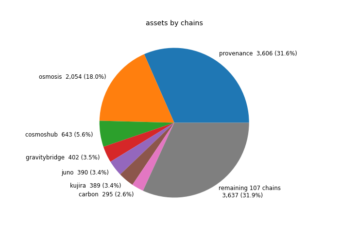
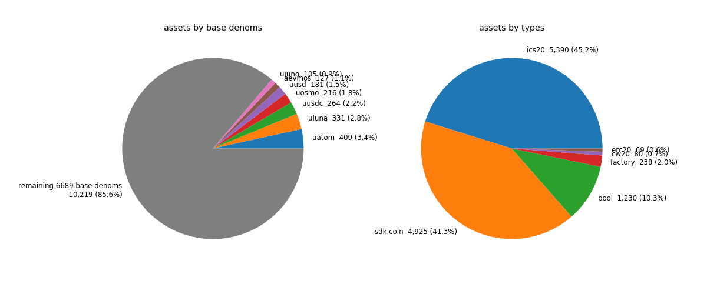

# Asset List of Cosmos-SDK Based Chains
On-chain based data allows to view all existing assets.<br>
<p align="center">
  
</p>

- [**chain-registry like data**](data_json)  
- [**csv data**](data_csv)  
- **contracts** ([code](https://github.com/Snedashkovsky/cw-on-chain-registry/tree/main/contracts/on-chain-registry), 
[schema](https://github.com/Snedashkovsky/cw-on-chain-registry/tree/main/contracts/on-chain-registry/schema))
  - [bostrom](https://cyb.ai/contracts/bostrom1eeahgvdsun8a04rh5vy9je49nllq6nj8ljmaslsvjeyg0j0063mssjcjmt)
<p align="center">
  
  
</p>

## Asset Data Structure
We use  chain-registry like [asset data structure](assetlist.schema.json) for better compatibility.  
  
Differences from [chain-registry asset data structure](https://github.com/cosmos/chain-registry/blob/master/assetlist.schema.json):
- add `chain_id` required property;
- `denom_units`, `display`, `name` and `symbol` asset object properties are optional
- add `chain_id` required property in asset traces section
- set `chain_name` property in asset traces section as optional
- add `supply` optional property in asset section and `base_supply` optional property in asset traces section
- add `admin` required property for `factory` asset type in asset section

## Contract queries
[Query schema](https://github.com/Snedashkovsky/cw-on-chain-registry/tree/main/contracts/on-chain-registry/schema/query_msg.json)  
[Query examples](asset_data.ipynb)  

## How to deploy
clone repo and optionally edit the `.env` file 
```bash 
git clone https://github.com/Snedashkovsky/on-chain-registry && \
cd on-chain-registry && \
cp .env.example .env
```
install python requirements
```bash
pip install -r requirements.txt
```

update asset list
```bash
make update
```

## Data Sources (REST APIs)
- /cosmos/bank/v1beta1/supply
    - `denom`
    - `amount` (`supply`)
```json
    {
      "denom": "gamm/pool/1",
      "amount": "216862733786995310900019706"
    }
```
- /cosmos/bank/v1beta1/denoms_metadata
    - `description`
    - `denom units`
        - `denom`
        - `exponent` (`decimals`)
        - `aliases`
    - `base` (`denom`)
    - `display`
    - `name`
    - `symbol`
```json
    {
      "description": "The bandwidth token of Bostrom",
      "denom_units": [
        {
          "denom": "millivolt",
          "exponent": 0,
          "aliases": []
        },
        {
          "denom": "volt",
          "exponent": 3,
          "aliases": [
            "VOLT"
          ]
        }
      ],
      "base": "millivolt",
      "display": "volt",
      "name": "Bostrom Volt",
      "symbol": "VOLT"
    }
```
- /ibc/core/channel/v1/channels
    - `chain_id_counterparty`
```json
{
    "@type": "/ibc.lightclients.tendermint.v1.ClientState",
    "chain_id": "cosmoshub-4",
    "trust_level": {
      "numerator": "1",
      "denominator": "3"
    },
    "trusting_period": "1209600s",
    "unbonding_period": "1814400s",
    "max_clock_drift": "60s",
    "frozen_height": {
      "revision_number": "0",
      "revision_height": "0"
    },
    "latest_height": {
      "revision_number": "4",
      "revision_height": "15547071"
    },
    "proof_specs": [
      {
        "leaf_spec": {
          "hash": "SHA256",
          "prehash_key": "NO_HASH",
          "prehash_value": "SHA256",
          "length": "VAR_PROTO",
          "prefix": "AA=="
        },
        "inner_spec": {
          "child_order": [
            0,
            1
          ],
          "child_size": 33,
          "min_prefix_length": 4,
          "max_prefix_length": 12,
          "empty_child": null,
          "hash": "SHA256"
        },
        "max_depth": 0,
        "min_depth": 0
      },
      {
        "leaf_spec": {
          "hash": "SHA256",
          "prehash_key": "NO_HASH",
          "prehash_value": "SHA256",
          "length": "VAR_PROTO",
          "prefix": "AA=="
        },
        "inner_spec": {
          "child_order": [
            0,
            1
          ],
          "child_size": 32,
          "min_prefix_length": 1,
          "max_prefix_length": 1,
          "empty_child": null,
          "hash": "SHA256"
        },
        "max_depth": 0,
        "min_depth": 0
      }
    ],
    "upgrade_path": [
      "upgrade",
      "upgradedIBCState"
    ],
    "allow_update_after_expiry": true,
    "allow_update_after_misbehaviour": true
  }
```
- /ibc/apps/transfer/v1/denom_traces (iterate by denom)
    - `denom_base`
    - `path`
    - `channels` (calculated from `path`)
```json
{
    "path": "transfer/channel-2",
    "denom_base": "uosmo"
  }
```
- /ibc/core/channel/v1/channels
    - `channel_id_counterparty`

```json
    {
      "state": "STATE_OPEN",
      "ordering": "ORDER_UNORDERED",
      "counterparty": {
        "port_id": "transfer",
        "channel_id": "channel-341"
      },
      "connection_hops": [
        "connection-10"
      ],
      "version": "ics20-1",
      "port_id": "transfer",
      "channel_id": "channel-8"
    }
```