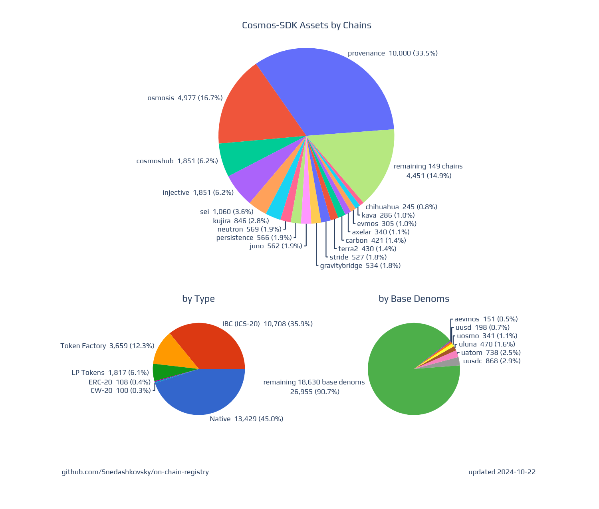

# On-Chain Registry: Cosmos-SDK Asset List
As assets shift between different chains within the Cosmos ecosystem and the broader cross-chain world, a clear 
and straightforward tool for tracking this data becomes necessary. 
The On-Chain Registry (OCR) gathers all the proof-of-nodes data for these assets as they navigate various chains, 
providing a real-time snapshot and comprehensive overview of the asset ecosystem.

## Proof-of-Nodes Conceptualization

OCR is more than just a list; it’s a dynamic, evolving, and self-sustaining protocol that fetches data directly from nodes.
This mechanism leads to:
 - **Accuracy**: The registry furnishes complete and precise data, crucial for meaningful and successful blockchain transactions.
 - **Reliability**: By ruling out the chance of human error, the registry delivers consistent information that users can rely on.
 - **Inclusivity**: It leaves out no data not specified in the chains, thereby offering a comprehensive overview of the blockchain environment.

<br>
<p align="center">
  
</p>

## Functionality

OCR provides an interface for updating, storing, and accessing data on-chain. 
This enables it to dynamically adapt to the ever-changing state of the chains.

API & IBC Tokens Verification. OCR functions as a robust and secure API, offering users the capability to verify 
Inter-Blockchain Communication (IBC) tokens with trusted and verified metadata. 
This feature further enhances the transparency and security of cross-chain transactions.

Integration of External Registries. In the pursuit of providing an all-encompassing data access point, 
OCR integrates data from other registries as well. 
This guarantees that users have a comprehensive, unified, and updated view of the entire blockchain ecosystem.

On-chain based data allows viewing of all existing assets:

- [**chain-registry like data**](data_json)  
- [**csv data**](data_csv)  
- **contracts** ([code](https://github.com/Snedashkovsky/cw-on-chain-registry/tree/main/contracts/on-chain-registry), 
[schema](https://github.com/Snedashkovsky/cw-on-chain-registry/tree/main/contracts/on-chain-registry/schema))
  - [bostrom](https://cyb.ai/contracts/bostrom1eeahgvdsun8a04rh5vy9je49nllq6nj8ljmaslsvjeyg0j0063mssjcjmt)
<p align="center">
  
</p>

## Asset Data Structure
We use  chain-registry like [asset data structure](assetlist.schema.json) for better compatibility.  
  
Differences from the [chain-registry asset data structure](https://github.com/cosmos/chain-registry/blob/master/assetlist.schema.json):
- add `chain_id` required property;
- `denom_units`, `display`, `name` and `symbol` asset object properties are optional;
- add `chain_id` required property in asset traces section;
- set `chain_name` property in asset traces section as optional;
- add `supply` optional property in asset section and `base_supply` optional property in asset traces section;
- add `admin` required property for `factory` asset type in asset section.

## Contract queries
[Query schema](https://github.com/Snedashkovsky/cw-on-chain-registry/tree/main/contracts/on-chain-registry/schema/query_msg.json)  
[Query examples](asset_data.ipynb)  

## How to deploy
clone repo and optionally edit the `.env` file 
```bash 
git clone https://github.com/Snedashkovsky/on-chain-registry && \
cd on-chain-registry && \
cp .env.example .env
```
install python requirements
```bash
pip install -r requirements.txt
```

update asset list
```bash
make update
```

## Data Sources 
[REST APIs Queries](data_sources.md)

## Contributions

We warmly welcome pull requests, issues, and feedback from the community.

